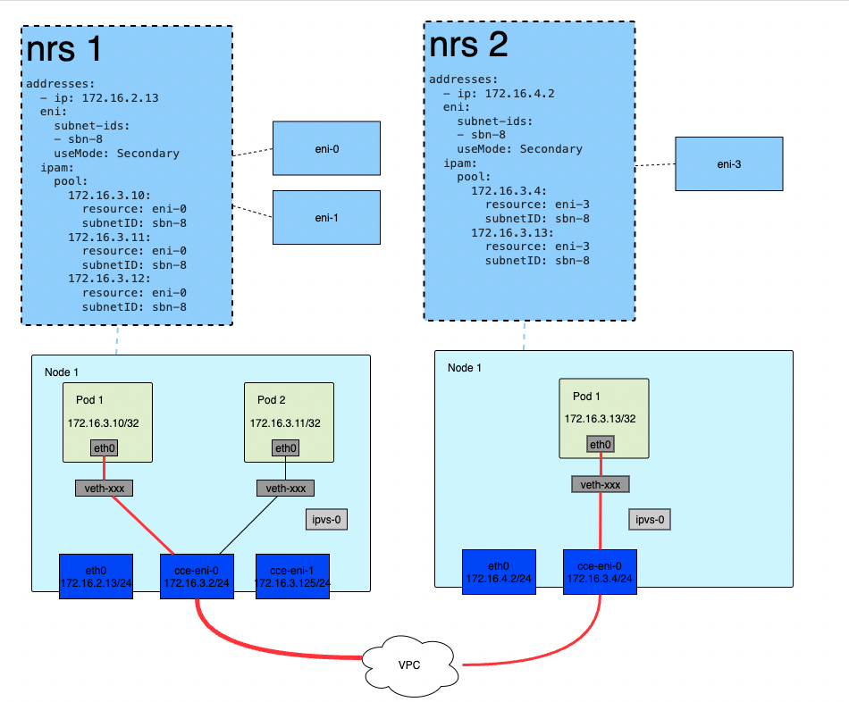
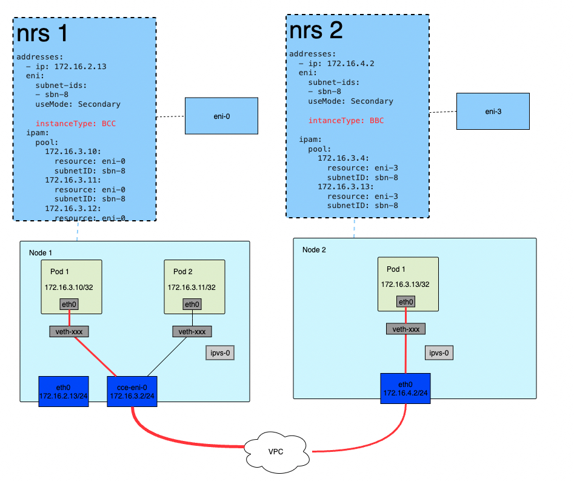
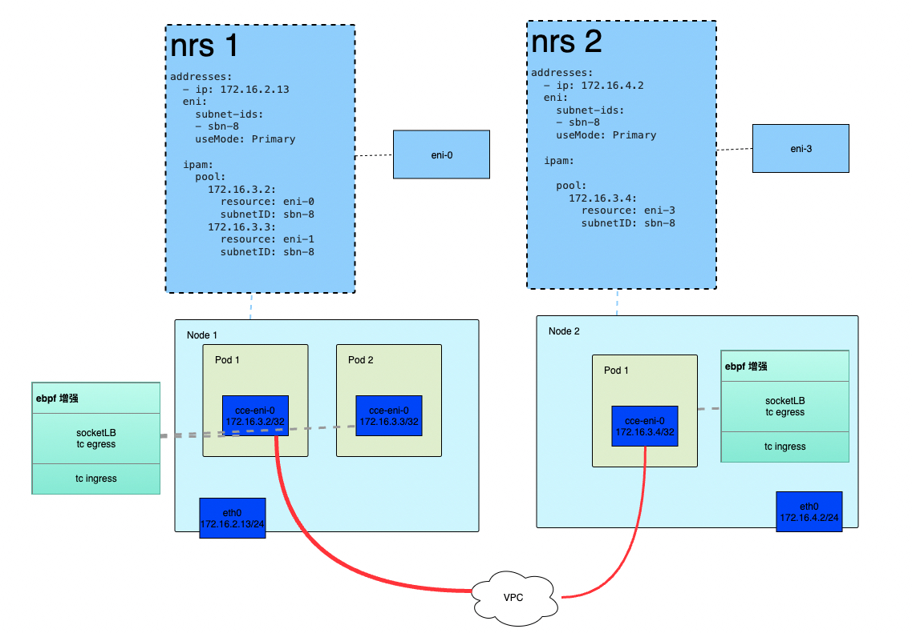
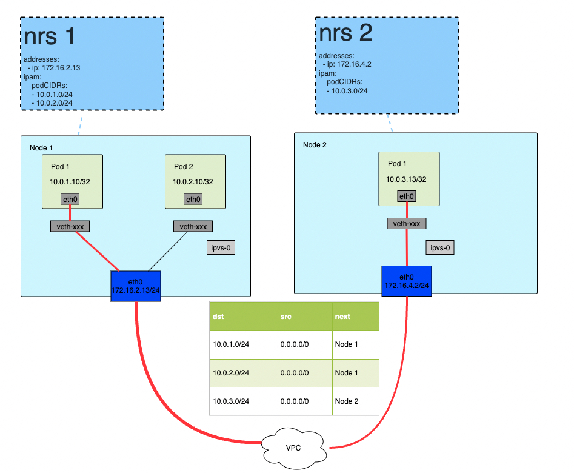

# CCE 容器网络模型
## 1. 概述
cce-network-v2 插件为百度智能云容器引擎 CCE 提供了网络能力，包括容器联通性、网络策略等能力。本文重点介绍 cce-network-v2 插件在容器模型和网络数据路径上的实现。

基于不同基础设施的特性和应用场景，CCE 设计了多种容器网络模型，包括：
* VPC-ENI 模式, Pod 直接使用 VPC 内的 IP
    * ENI 辅助 IP 模式（面向 BCC/EBC）
    * 主网卡辅助 IP 模式 （面向 BBC 和部分 EBC 机型）
    * 独占 ENI 模式（面向高性能场景 BCC）
    
* VPC-Route 模式

下面将分别介绍上述容器网络模型在 CCE 上的实现。

## 2. VPC-ENI 模式
VPC-ENI 模式是 CCE 原生于云的容器网络模型，Pod 和 BCC 等计算资源等价直接使用 VPC 内的 IP。同时可以利用 VPC 内的安全组和 ACL 对 Pod 进行安全隔离。

### 2.1 ENI 辅助 IP 模式
典型的 VPC-ENI 是面向 BCC/EBC 机型的 ENI 辅助 IP 模式。计算实例主网卡用于直接处理 k8s Node 通信，Pod 通过实例挂载的 ENI 网卡进行通信。VPC-ENI 网络逻辑拓扑如下图所示：

图中有几个关键点：
* Pod 直接使用 VPC 内 IP，无需 NAT.
* 红线表示 Pod 在与外部通信时的数据路径。
* Pod 向外通信时，通过 Pod 辅助 IP 所绑定的 ENI 网卡 收发数据包。
* 每一个 k8s Node 都有一个或多个独立的 NRS 对象，用于管理节点的 IP 资源池。
    * 每个 NRS 对象包含一个或多个 ENI 对象，用于和 VPC 保持资源状态同步。
    * 每个 ENI 对象包含一个或多个辅助 IP 地址。vpc-eni-veth
* 每一个 Pod 都有一个独立的 CCEEndpoint 对象，用于描述 Pod 的网络资源状态。
* 共享同一个 ENI 的多个 Pod 同时共享了 ENI 的带宽和安全组限制。

### 2.2 主网卡辅助 IP 模式
主网卡辅助 IP 模式是面向部分 EBC/BBC 机型的网络模型，使用计算实例主网卡用于直接处理 k8s Node 和 Pod 之间的通信。与 ENI 辅助 IP 模式相比，主网卡辅助 IP 模式下只有一个模拟 ENI 的主网卡。主网卡辅助 IP 模式网络逻辑拓扑如下图所示：

图中几个关键点：
* 左侧部分展示了 BBC 的 ENI 辅助 IP 模式网络逻辑拓扑。
* 右侧部分展示了 BBC 的主网卡辅助 IP 模式网络逻辑拓扑。相对于 ENI 辅助 IP 模式，主网卡辅助 IP 模式网络拓扑更为简单。
* 主网卡辅助 IP 模式网络 Pod 的 IP 在 VPC 中也有一个独立的身份。
* 百度智能云所有的 BBC 机型和部分 EBC 机型都支持主网卡辅助 IP 模式。BCC 机型不支持主网卡辅助 IP 模式。

### 2.3 独占 ENI 模式
独占 ENI 模式是面向高性能场景的容器网络模型，直接把 ENI 弹性网卡插入到 Pod 的网络命名空间中。与主网卡辅助 IP 模式相比，独占 ENI 模式网络拓扑更为简单，但由于单机可以插入的 ENI 设备数量有限， 单机 Pod 密度有很强的限制，因此独占 ENI 模式网络模型只适用于高并发场景。
独占 ENI 模式网络逻辑拓扑如下图所示：

图中有几个关键点：
* 一个BCC 计算实例上可以有一个或多个 ENI 设备，每个 ENI 设备对应一个 Pod。
* Pod 与外部通信时，通过 ENI 设备收发数据包。数据包不会经过主机协议栈。所以无法在机器上抓包。

## 3. VPC-Route 模式
VPC-Route 模式是 CCE 默认的容器网络模型，在创建集群时需要手动指定一个与 VPC CIDR 不重叠的容器网段。VPC-Route 模式网络逻辑拓扑简单，每个计算实例加入集群时，会默认为 Node 对应的 nrs 分配一个或多个 CIDR 作为 Pod 的 IP 地址池。VPC 路由模式网络逻辑拓扑如下图所示：

图中几个关键点：
* 每个 k8s Node 都有一个独立的 NRS 对象，每个 NRS 对象可能会对应多个 CIDR。在第一个 CIDR 不足时，会继续尝试下一个 CIDR。
* 每个 NRS 对象的 CIDR 最终都会写入到 VPC 路由表。注意保证容器网段的唯一性，避免 VPC 路由表和其它路由规则冲突。
* VPC-Route 容器网络拥有简洁易理解的网络拓扑，具备维护成本低，扩展性强的特点。

## 4. 其它容器网络模型
CCE 除了支持经典的 VPC-ENI 和 VPC-Route 两种容器网络模型，还支持其它增强容器网络模型，如：
* ebpf 加速容器网络
* ipvlan 容器网络
* overlay 容器网络等

更多容器网络模型介绍请参考每个网络模型的说明文档。