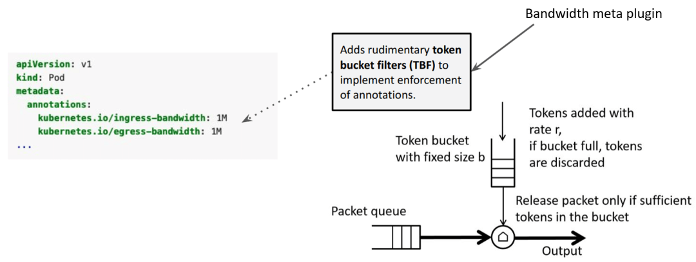
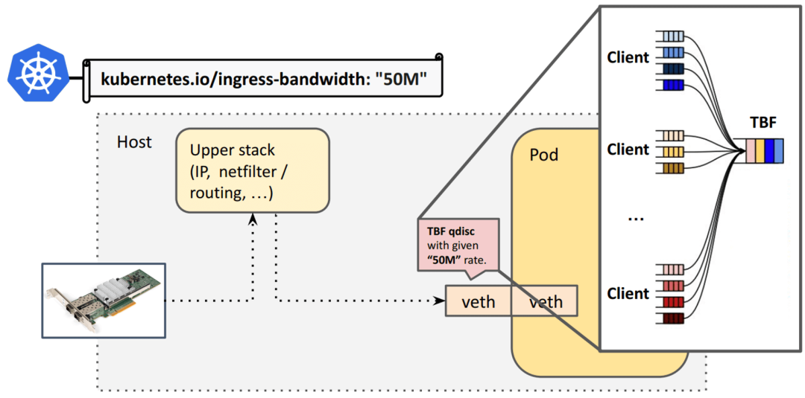
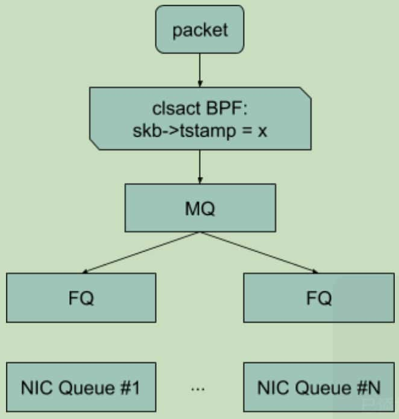
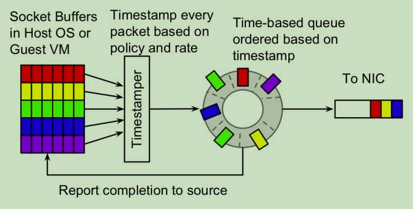

# EDT 带宽管理

## 经典容器网络下的带宽管理
经典的 k8s 容器网络的带宽管理通过设置Pod的Annotation 
```
kubernetes.io/ingress-bandwidth
kubernetes.io/egress-bandwidth
```
对容器进行带宽限制,CCE 容器网络插件会通过给容器在主机和容器端的veth pair 虚拟网络设备对设置 tc tbf（Token Bucket Filter，令牌桶过滤器）实现限速功能。


cce-network-v2 会解析用户的配置，利用 linux tc 子系统的 tbf 队列，在主机端虚拟网卡为容器配置入向带宽，在容器端虚拟网卡为容器配置出向带宽。

### tbf 队列的设计
tbf 在设计上是一个令牌桶，所有的数据包都会被放入一个队列中排队处理，如下图所示：


```
dev_queue_xmit():
 txq = netdev_core_pick_tx(dev, skb,...)
# qdisc points to the same HTB for all queues
 qdisc = txq->qdisc
 __dev_xmit_skb(skb, qdisc, dev, txq):
 spin_lock(qdisc.lock) # qdisc root lock
 qdisc->enqueue(skb, ...) # classify and queue
 spin_unlock(qdisc.lock
```

虽然 tbf 设计简单易于理解和维护，但是它存在一些限制：
* TBF Qdisc 所有 CPU 共享一个锁(qdisc root lock)，传输的数据包数越多，锁竞争越激烈，对延迟和吞吐都可能产生影响。
* veth pair 是单队列虚机网络设备，但可使用发送/接收数据包线程所在的 CPU 核来多 CPU 调度。但如果 veth pair 上被配置了单队列的 tbf，那么所有数据包都会被调度到同一个 CPU 核上，性能会受限于这个 CPU 核。


## EDT 带宽管理
EDT通过确保数据包不早于某个时间点发送，来控制带宽，而这个时间点是通过上一个数据包的发送时间加上一个延迟来确定的。数据包延迟的计算公式如下所示。
```
delay_ns = skb->len * NS_PER_SEC / aggregate_state->rate_limit_bps
```
例如，对容器限速10Kbit/s，那容器发送1Kbit大小的包，需要在上一个包发送0.1s之后。似乎可以理解为另一种形式的令牌桶，只不过数据包发送的“成本”由令牌变成了时间片。

EDT限速流程如下图所示：数据包在进入MQ队列之前，被设置skb->tstamp；在FQ队列中，确保数据包不会早于skb->tstamp设置的时间被发出。


```
aggregate_state = state[classify(skb)] # classify packet into flow aggregate
delay_ns = skb->len * NS_PER_SEC / aggregate_state->rate_limit_bps
next_tstamp = &aggregate_state->next_tstamp
if *next_tstamp <= now:
 *next_tstamp = now + delay_ns # racy, not an issue, same ballpark value expected
 return TC_ACT_OK
if *next_tstamp - skb->tstamp >= (int64_t)DROP_HORIZON: # 2s
 return TC_ACT_SHOT
if *next_tstamp > skb->tstamp:
 skb->tstamp = *next_tstamp # rate-limit
__sync_fetch_and_add(next_tstamp, delay_ns)
return TC_ACT_OK
```

* MQ：引用相关Patch里的介绍如下。是个多队列的框架，使用hash函数将流量分配到下面的多个队列。
> The mq qdisc is a dummy qdisc which sets up an array of pfifo_fast queues as a Traffic Control tc class under the root mq qdisc. One pfifo_fast queue is created for each hardware queue.
Traffic is placed into each queue using a hash function. This should allow traffic to spread across the multiple queues.
* FQ：公平队列，在被修改为EDT mode 后，能确保队列中的数据包不会早于skb->tstamp设置的时间被发出。其核心结构是一个timestamp的优先循环队列。


## 对比两种带宽管理
| 对比项 | EDT | tbf |
| --- | --- | --- |
| 优点 | 1. 性能好，对延迟的影响非常小。 | 1. 带宽控制力度精确；<br> 2. 可以在 tc qdisc 层级树中任意编排传输控制能力； |
| 缺点 | 1. 设计复杂，需要外部网络组件的编程支持；<br/>2. 带宽控制力度较粗，无法完成精细的带宽控制。 | 1. 性能差，尤其是在 PPS 较高的场景；<br/>2. 带宽控制粒度 |