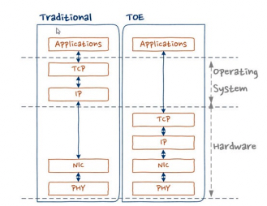
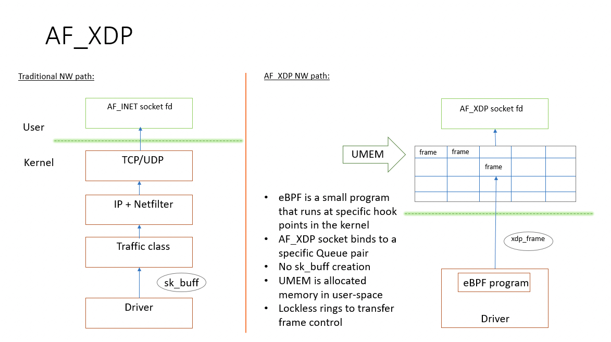
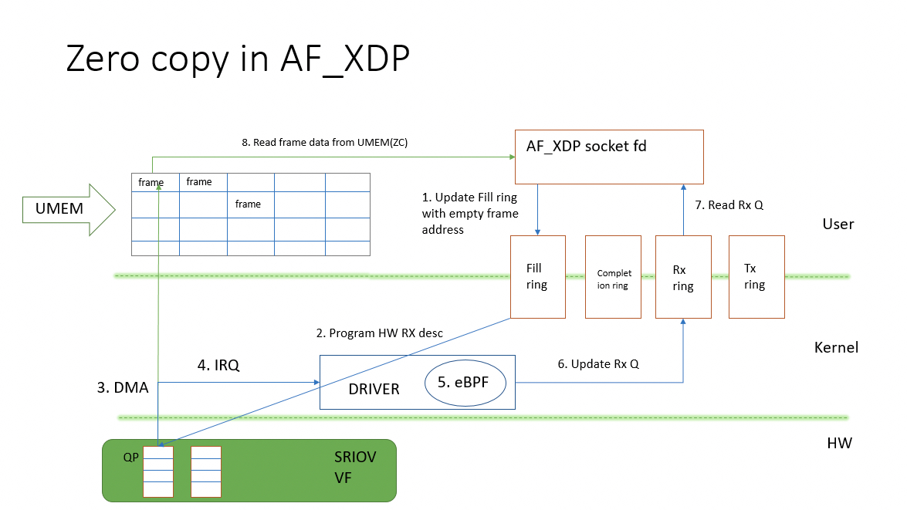
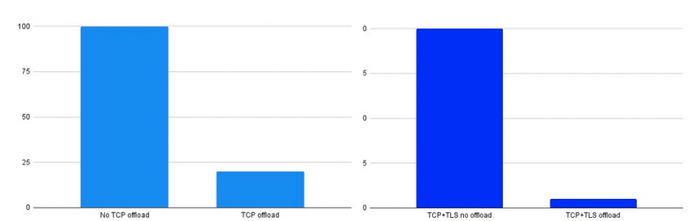
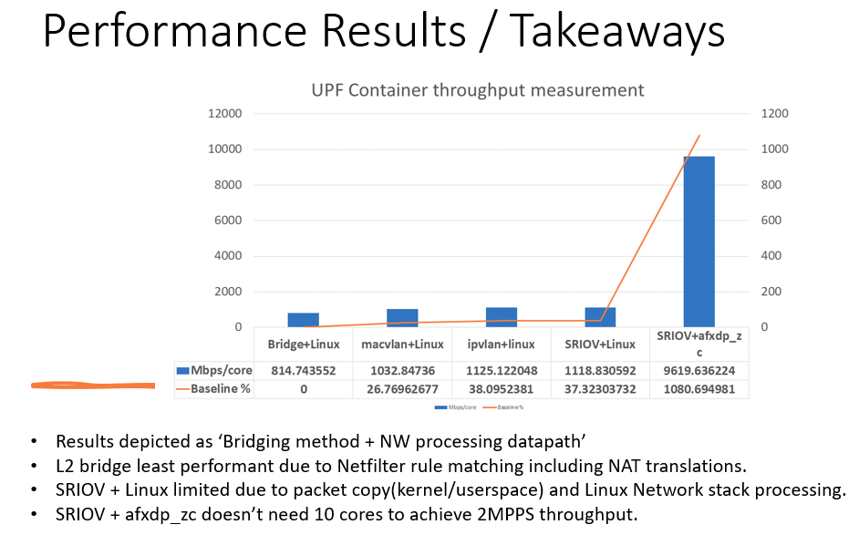
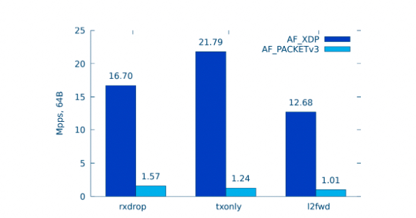

# AF_XDP
## 1. 概述
TCP Offload Engines (TOE) 是20世纪初的一个热门话题。前提是TCP协议处理可以卸载到专门的硬件上，以显著提高性能。虽然开发并推广了几种解决方案，但很快就清楚了TOE存在严重缺陷。除了少数小众用例外，TOE从未获得太多吸引力。虽然这些早期的TCP卸载尝试失败了，但加快TCP处理的愿望从未消失。但除此之外，TCP卸载还有一个新的动机：云厂商希望从服务器CPU卸载基础设施计算，以腾出运行应用程序代码的周期。本文提出了一种现代的TCP卸载方式，从服务器CPU卸载基础设施计算，包括TCP和上层协议处理。这种设计便于使用硬件加速来加快TCP处理，但避免了TOE的陷阱。

TCP和ULP卸载有两个主要好处：
•基础设施计算可以从服务器CPU卸载到卸载设备。这释放了服务器CPU的周期来运行更多的应用程序代码，这反过来又允许云厂商向其客户销售更多的CPU周期.
•卸载到专用设备有助于使用加速器加快处理速度，从而降低延迟、吞吐量和功耗.

这两个目标不一定是相辅相成的。例如，TCP卸载的一种简单方法可能是将连接处理从服务器CPU卸载到SmartNIC中的应用程序CPU。这实现了从服务器上卸载CPU周期的目标，但如果没有进一步的加速，对性能的净影响实际上可能比不卸载更糟。在某些用例中，节省服务器CPU周期可能是有价值的，即使是以小的性能损失为代价。尽管如此，由于应用程序CPU靠近硬件，因此有很多机会缩小这一差距，并最终通过TCP卸载提高性能。

此设计的基本思想是将TCP协议处理和TCP状态机从主机CPU卸载到SmartNIC中的应用程序CPU（应用程序CPU）。ULP处理，例如TLS加密/解密，也可以被卸载。TCP卸载由XDP传输接口协调。该接口使用具有共享硬件队列的AF_XDP套接字[1]来促进应用程序和设备之间基于通用和可扩展消息的通信。将AF_XDP套接字用于消息传递是一种新颖的方法，它具有TCP卸载之外的应用程序。对于TCP卸载，这种模型是有利的，因为不需要更改内核，并且我们可以利用eBPF和XDP来优化数据路径操作。
SmartNIC中的应用程序CPU是TCP卸载的目标。这可以是一个运行Linux的普通CPU，其中TCP处理在Linux堆栈中完成，从而避免了在硬件中运行TCP状态机时TOE的挑战。应用程序CPU中的用户空间代理称为卸载代理，用于实现连接卸载。在代理的一侧，在映射到服务器中的对等AF_XDP套接字的AF_XDP-套接字上接收XDP传输消息；在代理的另一侧是TCP连接的套接字。服务器CPU发送XDP传输消息以建立TCP连接并发送数据，卸载代理将在AF_XDP套接字上接收的消息转换为套接字函数调用。卸载代理在TCP套接字上接收数据，并将带有接收到的数据的XDP传输消息发送到服务器。

## 2. 架构
### 2.1 传统 TCP 卸载
TCP卸载引擎（TOE）早在20世纪90年代末就已经成为网络供应商的目标。
TOE的想法很清晰，IP和TCP协议是在硬件中处理的，而不是传统的操作系统。硬件提供了用于连接管理以及用于发送和接收数据的接口。硬件接口可以通过设备驱动程序暴露给操作系统，也可以通过内核旁路直接暴露给应用程序库。TOE的前提是硬件可以比软件更快地处理TCP，从而降低CPU利用率、延迟和吞吐量。

虽然TCP卸载引擎的发展确立了TCP卸载的性能优势，但TOE通常被认为是一种严重的失败。

TOE消亡的原因可以概括为：
1.硬件中的TCP实现很难修复，当发现TCP堆栈的安全问题时，这变得特别有问题。
2. 在边缘条件下，TCP的硬件实现实际上性能可能在主机OS协议栈更差。
3. 所有TCP连接卸载的成本是固定的，需要用户程序编程配合，操作系统无法优化特定用例。
4. 硬件中的TCP实现不完整，并不是索索 TCP 特性都实现了。
5. 透明 TCP卸载需要无缝集成到主机OS中，这使得调试和诊断变得困难。
6. 硬件中的TCP实现对TCP堆栈的可见性有限，这使得调试和诊断变得困难。

#### 2.1.2 传统方案的解决方案
1. 在新的设计中，TOE 的问题主要通过将 TCP 卸载到具有软件网络堆栈的 CPU 上来解决，而非具有特定功能的硬件。
2. 提高性能不再是卸载的第一目标，即使没有性能提高，TCP 卸载到另外一个 CPU 也会节省主机 CPU 周期。
3. 不再适用，因为卸载是在 CPU 中处理的，所以存在可编程优化的机会。
4. 应用CPU中的网络堆栈可以使用软件或硬件中可用的所有TCP功能和加速度。
5. 在应用CPU中使用AF_XDP套接字和用户空间代理可以避免更改服务器中的内核或应用CPU中的内核。
6. 通过卸载到运行软件中的TCP堆栈的CPU来解决，标准工具和技术可用于调试和诊断。

## 2.2 新一代的 TCP 卸载
### 2.2.1 要求
通用TCP卸载解决方案的要求如下：
* 减少服务器中的基础设施和网络处理开销，从而减少用于基础设施处理的服务器CPU周期
* 通过使用卸载堆栈可用的硬件加速和卸载，优化卸载TCP连接的性能。
* 通过TCP卸载上层协议。分析TCP流并在应用程序套接字上显示ULP消息。请注意，几乎所有TCP通信都是面向消息的（例如TLS、NVMe、RDMA、RPC等）
* 对服务器操作系统没有更改。我们只要求服务器操作系统是一个相当现代的内核版本，支持AF_XDP套接字。
* 基本TCP卸载不需要高端的硬件。最低要求是具有应用程序CPU和网络接口的设备，以及服务器CPU和应用程序CPU之间的无损共享硬件队列。
* 最大限度地减少应用程序更改。TCP卸载的应用程序接口可以由库提供，对应用程序的更改应该很简单。零应用程序更改解决方案可能使用LD_PRELOAD来覆盖系统调用，就像在OpenOnload中所做的那样。
* 支持知名的优化，包括轮询、零拷贝发送和接收数据操作、标头/数据拆分以及类似于KCM的连接多路复用。
* 为了获得更高级别的性能，可以在设备中使用先进的硬件加速，例如RDMA和NVMe。

### 2.2.2 简要设计
本部分概述了通过AF_XDP套接字的TCP和ULP卸载。
TCP卸载是通过将TCP处理从一个CPU（即“服务器CPU”）卸载到另一个CPU，即“应用程序CPU”或“应用程序处理器”来实现的。服务器CPU位于主机服务器中，应用程序CPU位于SmartNIC或其他“智能设备”中。

`AF_XDP` 套接字用于向在服务器CPU和应用程序CPU中运行的应用程序提供队列接口。在服务器CPU中，应用程序是使用XDP传输库（xdp_export库）与卸载设备交互的用户应用程序。XDP传输库提供了用户空间套接字，用于创建卸载的连接以及发送和接收数据。在应用程序CPU中，应用程序是一种TCP代理，称为卸载代理。卸载代理将在AF_XDP套接字上接收的消息映射到App CPU网络堆栈中的套接字调用。
用户应用程序链接到xdp_xport库,库函数通过AF_XDP套接字提供代理管理和数据操作。AF_XDP套接字绑定到TX/RX设备队列。几个AF_XDP套接字可以在硬件队列上多路复用。当多个CPU访问相同的硬件队列时，在硬件队列上多路复用AF_XDP套接字会在线程专用队列的数量和同步要求之间进行权衡。
在AF_XDP套接字上发送的消息称为XDP传输消息，并封装在具有实验EtherType的以太网帧中。消息可以是可变长度的，并且前面有一个指示消息类型的公共XDP传输头。消息类型决定了标头后面的消息正文的格式。

此外需要注意的事，AF_XDP socket不再通过 send()/recv()等函数实现报文收发，而实通过直接操作ring来实现报文收发。
##### 1. FILL RING
fill_ring 的生产者是用户态程序，消费者是内核态中的XDP程序；

用户态程序通过 fill_ring 将可以用来承载报文的 UMEM frames 传到内核，然后内核消耗 fill_ring 中的元素（后文统一称为 desc），并将报文拷贝到desc中指定地址（该地址即UMEM frame的地址）；

##### 2. COMPLETION RING
completion_ring 的生产者是XDP程序，消费者是用户态程序；

当内核完成XDP报文的发送，会通过 completion_ring 来通知用户态程序，哪些报文已经成功发送，然后用户态程序消耗 completion_ring 中 desc(只是更新consumer计数相当于确认)；

##### 3. RX RING
rx_ring的生产者是XDP程序，消费者是用户态程序；

XDP程序消耗 fill_ring，获取可以承载报文的 desc并将报文拷贝到desc中指定的地址，然后将desc填充到 rx_ring 中，并通过socket IO机制通知用户态程序从 rx_ring 中接收报文；

##### 4. TX RING
tx_ring的生产者是用户态程序，消费者是XDP程序；

用户态程序将要发送的报文拷贝 tx_ring 中 desc指定的地址中，然后 XDP程序 消耗 tx_ring 中的desc，将报文发送出去，并通过 completion_ring 将成功发送的报文的desc告诉用户态程序；

#### 2.2.2.1 xdp 代理
卸载代理在应用程序CPU的用户空间中运行。它的功能是接收来自服务器的卸载连接请求，建立和维护TCP连接，以及代理发送和接收数据。要在卸载的连接上发送数据，服务器会向卸载代理发送一条“发送数据”消息，其中包括要发送的数据；代理将数据写入TCP套接字。当在TCP套接字上接收到数据时，卸载代理会在“接收数据”消息中将其发送到服务器。在初始化时，卸载代理创建映射到共享硬件队列的AF_XDP套接字。XDP传输库创建对等AF_XDP套接字，用于发送命令和接收回复。

命令由应用程序通过XDP传输库发送，包括创建连接、启动侦听器、关闭连接和发送数据的请求。回复由卸载代理发送，包括连接成功报告、新传入连接和接收到的数据。

### 2.2.3 性能结果
#### 2.2.3.1 TCP卸载对 CPU 利用率的影响
通过AF_XDP套接字进行TCP卸载的主要目标是从主机CPU卸载CPU周期。下图比较了有卸载和无卸载时的主机CPU利用率。请注意，这些数据是基于对“概念验证”实施的初步分析和推断得出的。未来的工作包括更完整的实施和详细的性能分析.

TCP卸载的主要性能优势来自于消除执行路径中用于处理协议头的指令，在ULP（如TLS）的情况下，卸载算法也有好处。AF_XDP套接字预计固有地具有比TCP和UDP套接字等典型协议套接字更小的开销。管理卸载和支持API确实需要用户空间中的一些开销。这主要是在库函数中取消引用用户空间套接字的情况。流控制是作为用户空间套接字库的一部分实现的，它并不比管理用于流控制的套接字缓冲区更复杂，请注意，发送到卸载设备和从卸载设备发送的纯流控制消息可以最小化。

#### 2.2.3.2 TCP卸载对吞吐量的影响
下图显示了使用AF_XDP套接字进行TCP卸载时，吞吐量与CPU利用率之间的相关性。请注意，这些

#### 2.2.3.3 对比AF_XDP和AF_PACKET
