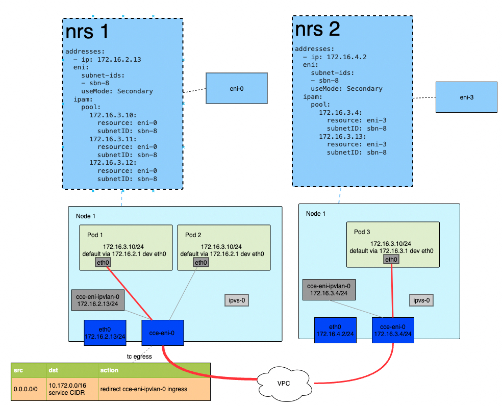
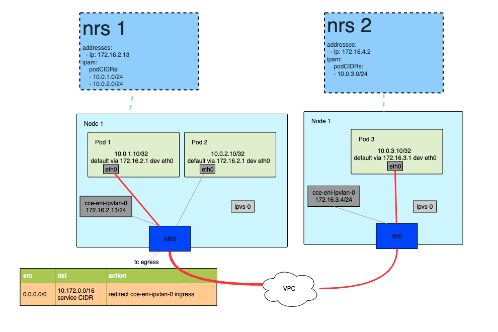

# ipvlan 网络驱动
在当今的云计算和数据中心环境中，容器技术已经成为了应用部署的主流方式。然而，随着容器化应用的规模和复杂性不断增加，对网络性能的要求也越来越高。veth pair 作为通用容器网络驱动以其简洁性而突出被广泛应用。但在对容器网络性能要求高，单机 CPU 资源竞争激烈的环境中，veth pair 驱动的效率会受到限制。

在容器环境中，网络性能对于应用的响应时间、吞吐量和可靠性至关重要。容器网络需要满足以下性能要求：
* 低延迟：应用之间的通信应该尽可能快速，以减少数据传输的延迟。
* 高吞吐量：网络需要支持大量的并发连接和数据流量，以确保系统的高效运行。
* 减少软中断：软中断会对系统的性能产生负面影响，干扰业务应用的运行时间，因此需要尽量减少它们的发生。

## 1. ipvlan 驱动介绍
ipvlan l2 是一种虚拟网络技术，它通过在物理网络接口上创建多个虚拟接口，实现了容器之间的隔离和通信。与 veth pair 网络驱动相比，ipvlan l2 在以下方面具有优势：
* 缩短数据包转发路径：ipvlan l2 直接在容器内核网络命名空间中处理数据包，避免数据包在主机网络命名空间和容器网络命名空间的切换，减少了 `sk_buff` 穿越内核协议栈的次数，从而显著缩短了数据包的转发路径。这有助于降低延迟和提高网络性能。
* 减少软中断：ipvlan l2 采用了更高效的数据包处理方式，减少了软中断的产生。软中断是一种内核机制，用于通知进程有网络事件发生。减少软中断的数量可以降低系统的开销，提高应用的 On-CPU 时间，提高整体性能。

综上所述，ipvlan l2 和 veth pair 的结合使用在容器网络中具有显著的性能优势。它们缩短了数据包转发路径，减少了软中断的发生，从而提高了网络的效率和响应能力。这对于要求高性能的应用场景，如实时数据处理、分布式系统等，尤为重要。

## 2. ipvlan 数据模型
当使用 ipvlan 驱动时，容器网络的拓扑模型相对会发生一些变化。下面分别说明在 VPC-ENI 和 VPC-Route 两种网络模型中，ipvlan 数据模型的差异。

### 2.1 VPC-ENI 网络模型
以 VPC-ENI 网络模型为例，ipvlan 驱动的容器网络拓扑如下图所示：

ipvlan l2 模式下，把 ENI 网卡的主 IP 与 ENI 的子设备 cce-eni-ipvlan-0 设备进行绑定。因此当 Node 内需要访问 Pod 时，则使用 cce-eni-ipvlan-0 设备的 IP 地址。ipvlan l2 模式下，容器网络的数据路径设计主要满足以下需求：
* Pod 内访问其他节点的数据包需要通过 Pod 所属的 ENI 进行收发。
* Pod 内部可以直接访问 service 网络，默认会通过 cce-eni-ipvlan-0 设备把数据包转发到宿主机协议栈，然后由宿主机协议栈的 ipvs 进行 service 网络的转发。
    * 在 service 转发中，Pod 默认使用 ENI 的主 IP 做 SANT 伪装，从而保证数据包在宿主机协议栈中能够正确转发。
    * 在 NodePort 的转发场景中，eth0 接收到数据包后，通过 cce-eni-ipvlan-0 设备转发给 Pod。
* 在非 Pod -> svc 场景，例如 Pod -> Pod 场景中，容器的数据包通信会直接从容器内发送到物理链路，这时会绕过宿主机协议栈。
    * 在宿主机上设置的 iptables 规则，仅在直接使用 Node 宿主机网络或者 Pod -> svc 场景中生效。
    * 在 ENI 上设置的安全组、ACL 策略不受单机网络驱动的影响。
    * ipvlan l2 驱动模式下，网络策略的实现仅能选用 eBPF 增强模式。
* cce-eni-ipvlan-0 设备仅用于从 Node 内向 Pod 转发数据包，这个数据包转发利用了 ipvlan l2 的快速数据包转发路径。

### 2.2 VPC-Route 网络模型
与 VPC-ENI 网络模型相比，VPC-Route 网络的ipvlan l2 容器网络拓扑更为简单，如下图所示： 

* cce-eni-ipvlan-0 设备仅用于从 Node 内向 Pod 转发数据包，这个数据包转发利用了 ipvlan l2 的快速数据包转发路径。
    * cce-eni-ipvlan-0 设备在实例启动时会自动创建，其 IP 地址一般是 eth0 的 IP 地址。
* Pod 内部可以直接访问 service 网络，默认会通过 cce-eni-ipvlan-0 设备把数据包转发到宿主机协议栈，然后由宿主机协议栈的 ipvs 进行 service 网络的转发。
    * 在 service 转发中，Pod 默认使用 ENI 的主 IP 做 SANT 伪装，从而保证数据包在宿主机协议栈中能够正确转发。
    * 在 NodePort 的转发场景中，eth0 接收到数据包后，通过 cce-eni-ipvlan-0 设备转发给 Pod。
* 在非 Pod -> svc 场景，例如 Pod -> Pod 场景中，容器的数据包通信会直接从容器内发送到物理链路，这时会绕过宿主机协议栈。
    * 在宿主机上设置的 iptables 规则，仅在直接使用 Node 宿主机网络或者 Pod -> svc 场景中生效。
    * 在计算实例主网卡上设置的安全组、ACL 策略不受单机网络驱动的影响。
    * ipvlan l2 驱动模式下，网络策略的实现仅能选用 eBPF 增强模式。

## 3. ipvlan & ebpf 增强驱动
ipvlan l2 驱动在Pod -> Pod 容器网络中具有明显的优势，但同时也会带来一些问题。例如：
* service 转发场景中，iptables 和 ipvs 很快会成为瓶颈点。
* Pod 数据包转发绕过了宿主机协议栈，导致宿主机上设置的 iptables 规则无法生效。
* 缺少成熟的网络可观测性组件的支持。

未来我们将会在 ipvlan l2 驱动的基础上，结合 eBPF 技术，实现 ebpf 增强驱动。是性能达到最优，同时又具备了网络可观测性、安全策略等功能的容器网络驱动。